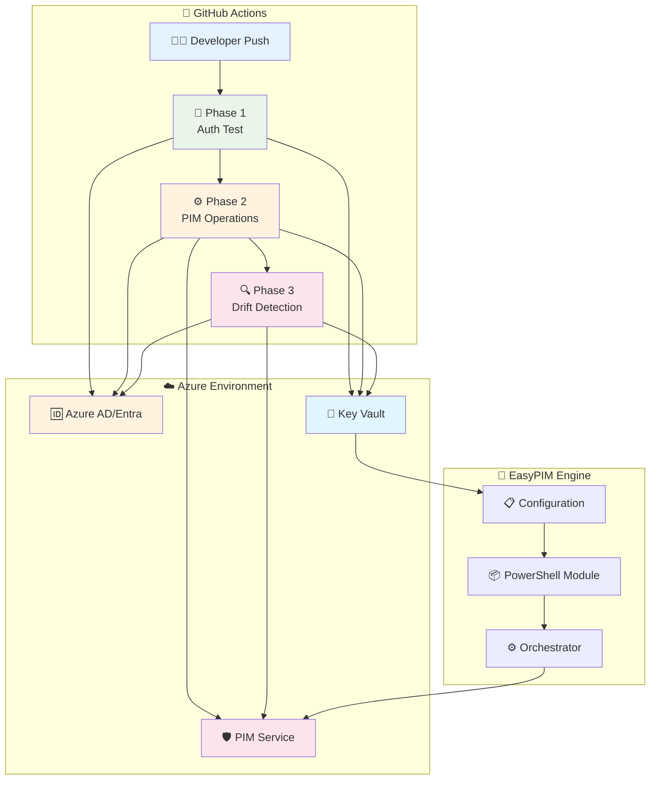

# 🚀 EasyPIM CI/CD Testing Framework

[](https://github.com/kayasax/EasyPIM-CICD-test/actions/workflows/01-auth-test.yml)
[](https://github.com/kayasax/EasyPIM-CICD-test/actions/workflows/02-orchestrator-test.yml)
[](https://github.com/kayasax/EasyPIM-CICD-test/actions/workflows/03-policy-drift-check.yml)


> **Automate Azure Privileged Identity Management with confidence** 🛡️
> A production-ready testing framework for integrating EasyPIM into your CI/CD pipelines with GitHub Actions.

---

## 🎯 Why This Framework?

- **🔐 Security First**: Test PIM operations safely with built-in dry-run modes
- **⚡ Production Ready**: Battle-tested workflows for real-world deployments
- **📊 Full Visibility**: Comprehensive logging and drift detection
- **🛠️ DevOps Native**: Seamless GitHub Actions integration with OIDC
- **🚀 Quick Start**: Get running in minutes with automated setup scripts

---

## 🏗️ Architecture at a Glance



---

## 🎪 Three-Phase Testing Strategy

<table>
<tr>
<td width="33%" align="center">

### 🔐 **Phase 1**
**Authentication & Connectivity**

```yaml
✅ OIDC Authentication
✅ Azure CLI Access
✅ Key Vault Connectivity
✅ Graph API Permissions
✅ EasyPIM Module Installation
```

*Can we securely connect?*

</td>
<td width="33%" align="center">

### ⚙️ **Phase 2**
**PIM Operations & Control**

```yaml
🔧 Policy Management
🔧 Role Assignments
🔧 Configuration Updates
🔧 Bulk Operations
```

*Can we manage roles safely?*

</td>
<td width="33%" align="center">

### 🔍 **Phase 3**
**Drift Detection & Compliance**

```yaml
📊 Policy Compliance
📊 Configuration Drift
📊 Automated Reporting
📊 Remediation Alerts
```

*Are we staying compliant?*

</td>
</tr>
</table>

---

## 🚀 Quick Start

### 🎬 Get Started in 3 Steps

<details>
<summary><b>1️⃣ 🍴 Fork & Clone</b></summary>

```bash
# Fork this repository, then clone it
git clone https://github.com/YOUR-USERNAME/EasyPIM-CICD-test.git
cd EasyPIM-CICD-test
```

</details>

<details>
<summary><b>2️⃣ 🔧 Automated Azure Setup</b></summary>

```powershell
# Deploy all required Azure resources
.\scripts\deploy-azure-resources.ps1

# Configure GitHub secrets automatically
.\scripts\configure-github-cicd.ps1
```

**What this creates:**
- Azure AD App Registration with federated credentials
- Key Vault with PIM configuration storage
- Required permissions and role assignments

</details>

<details>
<summary><b>3️⃣ ▶️ Run Your First Test</b></summary>

1. **Start with Phase 1** - Test authentication first:
   - Go to **Actions** → **"Phase 1: Authentication Test"**
   - Click **"Run workflow"** (no parameters needed)
   - Verify all authentication steps pass ✅

2. **Then run Phase 2** - Execute PIM operations:
   - Go to **Actions** → **"Phase 2: EasyPIM Orchestrator Test"**
   - Click **"Run workflow"** with these safe defaults:
     - ✅ WhatIf: `true` (preview mode)
     - 🔧 Mode: `delta` (incremental)
     - 📝 Description: "My first EasyPIM test"

3. **Finally Phase 3** - Check for drift:
   - Go to **Actions** → **"Phase 3: Policy Drift Detection"**
   - Click **"Run workflow"** to verify compliance

</details>

> 💡 **Pro Tip**: Always start with `WhatIf=true` to preview changes safely before applying them!

---

## 📦 What's Inside

```
📂 EasyPIM-CICD-test/
├── 🔄 .github/workflows/        # Production-ready GitHub Actions
│   ├── 01-auth-test.yml         # Phase 1: Authentication verification
│   ├── 02-orchestrator-test.yml # Phase 2: Main PIM operations
│   └── 03-policy-drift-check.yml# Phase 3: Automated compliance checking
├── ⚙️ configs/                  # Example PIM configurations
│   ├── pim-config.json         # Main configuration template
│   └── pim-roles.json          # Role definitions
├── 📜 scripts/                  # Setup automation scripts
│   ├── deploy-azure-resources.ps1    # Complete Azure setup
│   ├── configure-github-cicd.ps1     # GitHub integration
│   └── workflows/                     # Workflow helper scripts
├── 📚 docs/                     # Comprehensive documentation
│   └── Step-by-Step-Guide.md   # Detailed setup instructions
└── 🧪 tests/                   # Test configurations & examples
```

---

## ⚙️ Workflow Controls

### 🔐 Phase 1: Authentication Test

<table>
<tr><th>Parameter</th><th>Purpose</th><th>Default</th><th>Safe for Prod?</th></tr>
<tr><td><code>🧪 test_mode</code></td><td>Verbosity level</td><td><code>standard</code></td><td>✅ Always safe</td></tr>
</table>

### 🎛️ Phase 2: EasyPIM Orchestrator

<table>
<tr><th>Parameter</th><th>Purpose</th><th>Default</th><th>Safe for Prod?</th></tr>
<tr><td><code>🔍 WhatIf</code></td><td>Preview without changes</td><td><code>true</code></td><td>✅ Always safe</td></tr>
<tr><td><code>🔧 Mode</code></td><td>Execution type</td><td><code>delta</code></td><td>✅ Incremental only</td></tr>
<tr><td><code>⏭️ SkipPolicies</code></td><td>Assignments only</td><td><code>false</code></td><td>✅ Selective testing</td></tr>
<tr><td><code>⏭️ SkipAssignments</code></td><td>Policies only</td><td><code>false</code></td><td>✅ Selective testing</td></tr>
<tr><td><code>⚠️ AllowProtectedRoles</code></td><td>Global Admin access</td><td><code>false</code></td><td>⚠️ Use with caution</td></tr>
<tr><td><code>📝 Verbose</code></td><td>Detailed logging</td><td><code>false</code></td><td>✅ More information</td></tr>
<tr><td><code>📤 ExportWouldRemove</code></td><td>Audit removals</td><td><code>false</code></td><td>✅ Compliance tracking</td></tr>
</table>

### 🔍 Phase 3: Drift Detection

<table>
<tr><th>Parameter</th><th>Purpose</th><th>Default</th><th>Schedule</th></tr>
<tr><td><code>📝 Verbose</code></td><td>Detailed analysis</td><td><code>false</code></td><td>Daily 6 AM UTC</td></tr>
</table>

---

## 🔧 Configuration Examples

<details>
<summary><b>📋 Basic PIM Configuration</b></summary>

```json
{
  "ProtectedUsers": [
    "emergency-access-account-id"
  ],
  "PolicyTemplates": {
    "Standard": {
      "ActivationDuration": "PT8H",
      "ApprovalRequired": false,
      "MultiFactorRequired": true
    },
    "HighSecurity": {
      "ActivationDuration": "PT2H",
      "ApprovalRequired": true,
      "MultiFactorRequired": true,
      "Approvers": [{"id": "security-team-group-id"}]
    }
  },
  "EntraRoles": {
    "Policies": {
      "User Administrator": {"Template": "Standard"},
      "Global Administrator": {"Template": "HighSecurity"}
    }
  }
}
```

</details>

<details>
<summary><b>👥 Role Assignment Examples</b></summary>

```json
{
  "Assignments": {
    "EntraRoles": [
      {
        "roleName": "User Administrator",
        "assignments": [
          {
            "principalId": "user-or-group-id",
            "assignmentType": "Eligible",
            "justification": "Administrative access for user management"
          }
        ]
      }
    ],
    "AzureRoles": [
      {
        "roleName": "Contributor",
        "scope": "/subscriptions/your-subscription-id",
        "assignments": [
          {
            "principalId": "developer-group-id",
            "assignmentType": "Eligible",
            "justification": "Development environment access"
          }
        ]
      }
    ]
  }
}
```

</details>

---

## 🔒 Security & Compliance

### 🛡️ Built-in Safety Features

- **🔍 Dry Run First**: Default `WhatIf=true` prevents accidental changes
- **📋 Configuration Validation**: Schema validation by EasyPIM engine
- **🔐 OIDC Authentication**: No stored credentials or service principals
- **📊 Complete Audit Trail**: Every operation logged and tracked
- **⚠️ Protected Role Guards**: Explicit confirmation for sensitive roles
- **🎯 Least Privilege**: Minimal permissions following security best practices

### 📊 Monitoring & Alerts

- **✅ Real-time Status**: GitHub Actions provide immediate feedback
- **📈 Drift Detection**: Automated daily compliance checks
- **🚨 Failure Notifications**: Instant alerts on policy violations
- **📋 Compliance Reports**: Detailed logs for audit requirements

---

## 💡 Advanced Use Cases

<details>
<summary><b>🔄 Continuous Compliance</b></summary>

Set up automated drift detection to run daily:

```yaml
# Automatically scheduled in 03-policy-drift-check.yml
schedule:
  - cron: '0 6 * * *'  # Daily at 6 AM UTC
```

Get alerts when configuration drifts from desired state.

</details>

<details>
<summary><b>🚀 Multi-Environment Deployments</b></summary>

Use different configurations for dev/staging/prod:

```bash
# Different Key Vault secrets per environment
DEV_KEYVAULT_NAME: "kv-easypim-dev"
STAGING_KEYVAULT_NAME: "kv-easypim-staging"
PROD_KEYVAULT_NAME: "kv-easypim-prod"
```

</details>

<details>
<summary><b>🎯 Emergency Access Management</b></summary>

Quickly activate break-glass accounts:

```yaml
# Emergency workflow with AllowProtectedRoles=true
- name: "Emergency Access Activation"
  with:
    AllowProtectedRoles: true
    Mode: "initial"
    run_description: "Emergency access for incident response"
```

</details>

---

## 📚 Documentation & Support

| Resource | Description |
|----------|-------------|
| 📖 [Step-by-Step Guide](docs/Step-by-Step-Guide.md) | Complete setup and configuration |
| 🔧 [EasyPIM Module](https://github.com/easypim/easypim) | Official EasyPIM documentation |
| 🎬 [Video Walkthrough](#) | Watch the setup process *(coming soon)* |
| 💬 [Discussions](https://github.com/kayasax/EasyPIM-CICD-test/discussions) | Community support and Q&A |
| 🐛 [Issues](https://github.com/kayasax/EasyPIM-CICD-test/issues) | Bug reports and feature requests |

---

## 🤝 Contributing

We welcome contributions! Here's how you can help:

- 🐛 **Report Issues**: Found a bug? Let us know!
- 💡 **Suggest Features**: Have ideas for improvements?
- 📖 **Improve Docs**: Help make our documentation better
- 🧪 **Add Tests**: Contribute new test scenarios

See our [Contributing Guidelines](CONTRIBUTING.md) for more details.

---

## 📄 License

This project is licensed under the MIT License - see the [LICENSE](LICENSE) file for details.

---

<div align="center">

**🚀 Ready to automate your PIM workflows?**

[Get Started Now](#-quick-start) • [View Documentation](docs/Step-by-Step-Guide.md) • [Join Discussions](https://github.com/kayasax/EasyPIM-CICD-test/discussions)

---

*Built with ❤️ for the Azure DevOps community*

</div>
