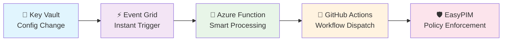

# 🚀 EasyPIM CI/CD Automation

> **🛡️ Revolutionize your Azure Privileged Identity Management with event-driven automation!**
> Transform manual PIM operations into seamless, secure, and auditable workflows that respond to configuration changes in real-time.

---

## ✨ **Why Teams Choose This Framework**

### 🔥 **The Problem We Solve**
*Manual PIM management is time-consuming, error-prone, and doesn't scale*

| ❌ **Before** | ✅ **After** |
|---------------|--------------|
| 🐌 Manual role assignments taking hours | ⚡ Automated workflows completing in minutes |
| 😰 Configuration drift going unnoticed | 🔍 Real-time drift detection and alerts |
| 🔄 Repetitive, error-prone tasks | 🤖 Intelligent automation with safety checks |
| 📋 Time-consuming compliance reporting | 📊 Automated compliance validation |
| 🚨 Security changes happening in isolation | 🔔 Event-driven responses to configuration changes |

---

## 🎯 **Key Benefits That Matter**

<table>
<tr>
<td width="50%">

### 🛡️ **Enterprise Security**
- ✅ **Event-Driven Automation**: Responds instantly to Key Vault changes
- ✅ **Zero-Trust Architecture**: OIDC authentication, no stored secrets
- ✅ **Safety-First Design**: Built-in WhatIf modes and validation
- ✅ **Comprehensive Auditing**: Every action logged and traceable

</td>
<td width="50%">

### ⚡ **Operational Excellence**
- ✅ **Real-Time Monitoring**: Continuous drift detection
- ✅ **Smart Parameter Detection**: Automatic test vs. production modes
- ✅ **Scalable Architecture**: From startups to enterprise
- ✅ **DevOps Integration**: Native GitHub Actions workflows

</td>
</tr>
</table>

---

## 🚀 **Complete Event-Driven Automation**

**🎭 Intelligence Built-In:**
- 🧠 **Smart Detection**: Test secrets trigger WhatIf mode, production secrets enable full automation
- 🔄 **Instant Response**: Configuration changes automatically trigger appropriate workflows
- 🛡️ **Safety Guardrails**: Multiple validation layers prevent unauthorized changes
- 📊 **Complete Visibility**: End-to-end tracing from change to enforcement

---

## 🎯 **Perfect For Your Team If...**

| 🏢 **Enterprise IT** | 🚀 **DevOps Teams** | 🛡️ **Security Teams** |
|---------------------|---------------------|----------------------|
| Managing 100+ privileged roles | Need PIM in CI/CD pipelines | Require continuous compliance |
| Want to eliminate manual tasks | Building Infrastructure as Code | Must track all access changes |
| Need compliance automation | Love event-driven architectures | Want real-time security monitoring |

---

## 🎬 **Get Started in 15 Minutes**

### 🔥 **Ready to Transform Your PIM Operations?**

**[📖 Follow Our Complete Step-by-Step Guide →](docs/Step-by-Step-Guide.md)**

*Everything you need: Azure setup, Event Grid integration, GitHub configuration, and real-world examples*

---

## 📋 **What's Included**

| Component | Description | Status |
|-----------|-------------|--------|
| 🔐 **Authentication Framework** | OIDC integration with Azure AD | ✅ Production Ready |
| ⚡ **Event Grid Integration** | Real-time Key Vault change detection | ✅ Production Ready |
| 🔧 **Azure Function** | Smart workflow triggering with parameter detection | ✅ Production Ready |
| 🚀 **GitHub Actions Workflows** | 3-phase testing and deployment automation | ✅ Production Ready |
| 📊 **Drift Detection** | Continuous compliance monitoring | ✅ Production Ready |
| 🛠️ **Deployment Scripts** | One-click Azure resource provisioning | ✅ Production Ready |
| 📖 **Complete Documentation** | Step-by-step implementation guide | ✅ Production Ready |

---

### 🎯 **Start Your PIM Automation Journey**

**[📖 Complete Setup Guide](docs/Step-by-Step-Guide.md)** • **[🔧 Scripts Documentation](scripts/README.md)** • **[🚀 GitHub Actions](https://github.com/kayasax/EasyPIM-EventDriven-Governance/actions)**

---

*Built with ❤️ for Azure administrators who value security, automation, and operational excellence*
*Loïc*

