[](https://github.com/kayasax/EasyPIM-CICD-test/actions/workflows/02-orchestrator-test.yml)
# EasyPIM CI/CD Testing Framework

A comprehensive testing framework for demonstrating **EasyPIM** integration in CI/CD pipelines using Azure Privileged Identity Management with automated workflow orchestration.

## 🏗️ Architecture Overview

### System Flow

```mermaid
flowchart LR
    DEV[👨‍💻 Developer] --> |Push Code| GH[📂 GitHub]
    GH --> |Trigger| CICD[🔄 CI/CD Pipeline]
    CICD --> |Authenticate| AZURE[☁️ Azure]
    AZURE --> |Execute| PIM[🔐 PIM Operations]
    PIM --> |Report| RESULTS[📊 Results]

    style DEV fill:#e1f5fe
    style GH fill:#f3e5f5
    style CICD fill:#fff3e0
    style AZURE fill:#e8f5e8
    style PIM fill:#fce4ec
    style RESULTS fill:#f1f8e9
```


### Three-Phase Testing Strategy

| Phase | Focus | Status Check |
|-------|-------|--------------|
| **🔐 Phase 1** | Authentication & Connectivity | ✅ Can we connect? |
| **⚙️ Phase 2** | PIM Operations & Configuration | 🔧 Can we manage roles? |
| **🔍 Phase 3** | Drift Detection & Compliance | 📋 Are we compliant? |

### Key Components

```mermaid
graph TB
    subgraph "🏠 GitHub Environment"
        REPO[Repository]
        WORKFLOW[Workflows]
        SECRETS[Secrets & Variables]
    end

    subgraph "☁️ Azure Environment"
        AD[Azure AD]
        KV[Key Vault]
        PIM_SVC[PIM Service]
    end

    subgraph "🔧 EasyPIM Engine"
        MODULE[PowerShell Module]
        CONFIG[Configuration]
        OPERATIONS[Operations]
    end

    REPO --> WORKFLOW
    WORKFLOW --> SECRETS
    SECRETS --> AD
    AD --> KV
    KV --> MODULE
    MODULE --> CONFIG
    CONFIG --> OPERATIONS
    OPERATIONS --> PIM_SVC

    style REPO fill:#f9f9f9
    style AD fill:#e3f2fd
    style KV fill:#e8f5e8
    style MODULE fill:#fff3e0
```



## Overview

This repository demonstrates how to integrate **EasyPIM** (Privileged Identity Management) into CI/CD workflows for secure, just-in-time access to Azure resources. The framework uses the official EasyPIM orchestrator action to test various authentication methods, privilege escalation scenarios, and deployment patterns.

## 🎯 Testing Phases

## 🎯 Testing Phases

### 🔐 Phase 1: Authentication Test
> **Goal:** Verify secure connection to Azure services
> **Workflow:** `01-auth-test.yml`
> **What it tests:** OIDC login, Key Vault access, Graph API connectivity

### ⚙️ Phase 2: PIM Operations
> **Goal:** Execute EasyPIM orchestrator with full control
> **Workflow:** `02-orchestrator-test.yml`
> **What it tests:** Policy management, role assignments, configuration validation

### 🔍 Phase 3: Drift Detection
> **Goal:** Ensure configuration compliance
> **Integrated:** Part of Phase 2 workflow
> **What it tests:** Policy drift detection, compliance reporting

## 🔧 Setup Requirements

### Prerequisites
- **Azure Subscription** with PIM enabled
- **Azure AD/Entra ID** administrative access
- **GitHub Repository** with Actions enabled

### Quick Setup
1. **Azure Configuration**
   ```bash
   # Create Azure AD App with federated credentials
   # Assign required PIM permissions
   # Deploy Key Vault for configuration storage
   ```

2. **GitHub Configuration**
   ```yaml
   # Repository Secrets (sensitive data)
   AZURE_CLIENT_ID: "your-app-id"
   AZURE_TENANT_ID: "your-tenant-id"
   AZURE_SUBSCRIPTION_ID: "your-subscription-id"

   # Repository Variables (non-sensitive)
   AZURE_KEYVAULT_NAME: "your-keyvault-name"
   AZURE_KEYVAULT_SECRET_NAME: "pim-config"
   ```

3. **EasyPIM Configuration**
   ```json
   {
     "ProtectedUsers": ["breakglass-user-id"],
     "PolicyTemplates": {
       "Standard": {
         "ActivationDuration": "PT8H",
         "ApprovalRequired": false
       }
     },
     "EntraRoles": {
       "Policies": {
         "User Administrator": { "Template": "Standard" }
       }
     }
   }
   ```

### Azure Configuration
1. **Entra ID Application Registration**
   - Federated credentials for GitHub OIDC
   - Required Graph permissions for PIM operations

2. **PIM Configuration**
   - Eligible role assignments
   - Activation policies
   - Approval workflows (optional)

### GitHub Configuration
```yaml
# Secrets (sensitive)
AZURE_CLIENT_ID: "your-app-id"
AZURE_TENANT_ID: "your-tenant-id"
AZURE_SUBSCRIPTION_ID: "your-subscription-id"

# Variables (non-sensitive)
AZURE_KEYVAULT_NAME: "your-keyvault"
AZURE_KEYVAULT_SECRET_NAME: "pim-config"
```

## 📁 What's Included

```
📦 EasyPIM-CICD-test
├── 🔄 .github/workflows/     # Three-phase testing workflows
├── ⚙️ configs/              # PIM configuration examples
├── 📜 scripts/              # Setup and deployment scripts
├── 📚 docs/                 # Step-by-step guides & documentation
│   └── Step-by-Step-Guide.md # 📖 Complete setup & testing guide
└── 🧪 tests/               # Test configurations
```

## ⚡ EasyPIM Integration

### OIDC Authentication Bridge
EasyPIM modules require `Connect-MgGraph` authentication, but our GitHub Actions use OIDC. We bridge this gap by:

```yaml
# Get Graph token from Azure CLI (already OIDC authenticated)
$graphToken = az account get-access-token --resource https://graph.microsoft.com --query accessToken --output tsv

# Use token to authenticate Graph PowerShell SDK
$secureToken = ConvertTo-SecureString $graphToken -AsPlainText -Force
Connect-MgGraph -AccessToken $secureToken -NoWelcome
```

### How It Works
```yaml
# Simple workflow step that does it all
- name: 'Run EasyPIM Orchestrator'
  shell: pwsh
  run: |
    # Install modules
    Install-Module EasyPIM.Orchestrator -Force

    # Bridge OIDC authentication to Graph SDK
    $graphToken = az account get-access-token --resource https://graph.microsoft.com --query accessToken --output tsv
    Connect-MgGraph -AccessToken (ConvertTo-SecureString $graphToken -AsPlainText -Force) -NoWelcome

    # Execute EasyPIM operations
    Invoke-EasyPIMOrchestrator `
      -KeyVaultName ${{ vars.AZURE_KEYVAULT_NAME }} `
      -TenantId ${{ secrets.AZURE_TENANT_ID }} `
      -WhatIf:${{ inputs.WhatIf }}
```

### Available Controls

| Input | Purpose | Default |
|-------|---------|---------|
| **WhatIf** | Preview without changes | `true` ✅ |
| **Mode** | `delta` or `initial` | `delta` |
| **SkipPolicies** | Assignments only | `false` |
| **SkipAssignments** | Policies only | `false` |
| **Force** | Skip confirmations | `false` |
| **Verbose** | Detailed logging | `false` |

### Configuration Example

```json
{
  "ProtectedUsers": ["emergency-access-account-id"],
  "PolicyTemplates": {
    "Standard": {
      "ActivationDuration": "PT8H",
      "ApprovalRequired": false
    },
    "HighSecurity": {
      "ActivationDuration": "PT2H",
      "ApprovalRequired": true,
      "Approvers": [{"id": "security-team-id"}]
    }
  },
  "EntraRoles": {
    "Policies": {
      "User Administrator": {"Template": "Standard"},
      "Global Administrator": {"Template": "HighSecurity"}
    }
  },
  "Assignments": {
    "EntraRoles": [{
      "roleName": "User Administrator",
      "assignments": [{
        "principalId": "user-id",
        "assignmentType": "Eligible",
        "justification": "Administrative access"
      }]
    }]
  }
}
```

## 🚀 Quick Start

1. **Fork this repository**
2. **Set up Azure resources** using our deployment script:
   ```powershell
   .\scripts\deploy-azure-resources.ps1
   ```
3. **Configure GitHub secrets** automatically:
   ```powershell
   .\scripts\configure-github-cicd.ps1
   ```
4. **Run Phase 1** to test authentication
5. **Run Phase 2** to execute PIM operations

> 💡 **Tip:** Start with `WhatIf=true` to preview changes safely!

> 📖 **Need detailed instructions?** See our comprehensive [Step-by-Step Guide](docs/Step-by-Step-Guide.md) for complete setup and testing procedures.

## 📊 Monitoring & Logging

All workflows include comprehensive logging:
- EasyPIM orchestrator execution status
- PIM role activation attempts
- Configuration validation results
- Error details and troubleshooting information

## 🔒 Security Considerations

- **No Scripts Required**: Uses official EasyPIM orchestrator action
- **Schema Validation**: Configuration validated by EasyPIM
- **Audit Trail**: All operations logged for compliance
- **Dry Run Mode**: Safe testing without actual role activations
- **Least Privilege**: Minimal permissions following EasyPIM recommendations
