# 🚀 EasyPIM CI/CD Testing Framework

[](https://github.com/kayasax/EasyPIM-CICD-test/actions/workflows/01-auth-test.yml)
[](https://github.com/kayasax/EasyPIM-CICD-test/actions/workflows/02-orchestrator-test.yml)
[](https://github.com/kayasax/EasyPIM-CICD-test/actions/workflows/03-policy-drift-check.yml)


> **Automate Azure Privileged Identity Management with confidence** 🛡️
> A production-ready testing framework for integrating EasyPIM into your CI/CD pipelines with GitHub Actions.

---

## 🎯 Why This Framework?

- **🔐 Security First**: Test PIM operations safely with built-in dry-run modes
- **⚡ Production Ready**: Battle-tested workflows for real-world deployments
- **📊 Full Visibility**: Comprehensive logging and drift detection
- **🛠️ DevOps Native**: Seamless GitHub Actions integration with OIDC
- **🚀 Quick Start**: Get running in minutes with automated setup scripts

---

## 🏗️ Architecture at a Glance

```mermaid
flowchart TB
    subgraph "🚀 GitHub Actions"
        DEV[👨‍💻 Developer Push]
        P1[🔐 Phase 1<br/>Auth Test]
        P2[⚙️ Phase 2<br/>PIM Operations]
        P3[🔍 Phase 3<br/>Drift Detection]
    end

    subgraph "☁️ Azure Environment"
        AAD[🆔 Azure AD/Entra]
        KV[🔑 Key Vault]
        PIM[🛡️ PIM Service]
    end

    subgraph "🔧 EasyPIM Engine"
        MOD[📦 PowerShell Module]
        ORC[⚙️ Orchestrator]
        CFG[📋 Configuration]
    end

    DEV --> P1
    P1 --> P2
    P2 --> P3

    %% All phases connect to Entra ID for authentication
    P1 --> AAD
    P2 --> AAD
    P3 --> AAD

    %% All phases connect to Key Vault for configuration
    P1 --> KV
    P2 --> KV
    P3 --> KV

    %% Phase 2 & 3 interact with PIM Service
    P2 --> PIM
    P3 --> PIM

    %% EasyPIM Engine flow
    KV --> CFG
    CFG --> MOD
    MOD --> ORC
    ORC --> PIM

    style DEV fill:#e3f2fd
    style P1 fill:#e8f5e8
    style P2 fill:#fff3e0
    style P3 fill:#fce4ec
    style AAD fill:#fff3e0
    style KV fill:#e1f5fe
    style PIM fill:#fce4ec
```



---

## 🎪 Three-Phase Testing Strategy

<table>
<tr>
<td width="33%" align="center">

### 🔐 **Phase 1**
**Authentication & Connectivity**

```yaml
✅ OIDC Authentication
✅ Azure CLI Access
✅ Key Vault Connectivity
✅ Graph API Permissions
✅ ARM Authentication
✅ EasyPIM Module Installation
```

*Can we securely connect?*

</td>
<td width="33%" align="center">

### ⚙️ **Phase 2**
**PIM Operations & Control**

```yaml
🔧 Policy Management
🔧 Role Assignments
🔧 Configuration Updates
🔧 Bulk Operations
```

*Can we manage roles safely?*

</td>
<td width="33%" align="center">

### 🔍 **Phase 3**
**Drift Detection & Compliance**

```yaml
📊 Policy Compliance
📊 Configuration Drift
📊 Automated Reporting
📊 Remediation Alerts
```

*Are we staying compliant?*

</td>
</tr>
</table>

---

## 🚀 Quick Start

### 🎬 Get Started in 3 Steps

<details>
<summary><b>1️⃣ 🍴 Fork & Clone</b></summary>

```bash
# Fork this repository, then clone it
git clone https://github.com/YOUR-USERNAME/EasyPIM-CICD-test.git
cd EasyPIM-CICD-test
```

</details>

<details>
<summary><b>2️⃣ 🔧 Automated Azure Setup</b></summary>

**Option A: Fully Automated (Recommended)**
```powershell
# Complete Azure setup with all resources and permissions
.\scripts\deploy-azure-resources.ps1

# Configure GitHub secrets and variables automatically
.\scripts\configure-github-cicd.ps1
```

**Option B: Manual Setup**
```powershell
# 1. Create Azure AD App Registration with federated credentials
az ad app create --display-name "EasyPIM-CICD" \
  --web-redirect-uris "https://github.com" \
  --required-resource-accesses @scripts/app-permissions.json

# 2. Configure OIDC federated credentials for GitHub
az ad app federated-credential create --id <app-id> \
  --parameters @scripts/federated-credentials.json

# 3. Deploy Key Vault and assign permissions
az deployment group create \
  --resource-group <your-rg> \
  --template-file scripts/deploy-azure-resources.bicep \
  --parameters @scripts/deploy-azure-resources.parameters.json

# 4. Grant PIM administrative permissions
.\scripts\grant-subscription-owner.ps1 -AppId <app-id>
```

**What this creates:**
- 🆔 Azure AD App Registration with GitHub OIDC federated credentials
- 🔑 Key Vault with secure PIM configuration storage
- 🛡️ Required Microsoft Graph API permissions for PIM operations
- 📋 Role assignments for PIM administrative access
- 🔧 Parameter file templates for your environment

</details>

<details>
<summary><b>3️⃣ ▶️ Run Your First Test</b></summary>

1. **Start with Phase 1** - Test authentication first:
   - Go to **Actions** → **"Phase 1: Authentication Test"**
   - Click **"Run workflow"** (no parameters needed)
   - Verify all authentication steps pass ✅

2. **Then run Phase 2** - Execute PIM operations:
   - Go to **Actions** → **"Phase 2: EasyPIM Orchestrator Test"**
   - Click **"Run workflow"** with these safe defaults:
     - ✅ WhatIf: `true` (preview mode)
     - 🔧 Mode: `delta` (incremental)
     - 📝 Description: "My first EasyPIM test"

3. **Finally Phase 3** - Check for drift:
   - Go to **Actions** → **"Phase 3: Policy Drift Detection"**
   - Click **"Run workflow"** to verify compliance

</details>

> 💡 **Pro Tip**: Always start with `WhatIf=true` to preview changes safely before applying them!

---

## Detailed Setup Guide

### 🎯 Prerequisites

Before starting, ensure you have:
- **Azure Subscription** with Global Administrator or Privileged Role Administrator access
- **GitHub Repository** with Actions enabled (fork this repo)
- **Azure CLI** installed and authenticated (`az login`)
- **PowerShell 7+** for running setup scripts

### 🔧 Step-by-Step Manual Setup

<details>
<summary><b>Step 1: 🆔 Create Azure AD App Registration</b></summary>

```powershell
# Set your GitHub repository details
$GitHubOrg = "YOUR-GITHUB-USERNAME"  # Replace with your GitHub username
$GitHubRepo = "EasyPIM-CICD-test"
$AppName = "EasyPIM-CICD-$(Get-Random)"

# Create the app registration
$appId = az ad app create --display-name $AppName --query appId -o tsv

# Get tenant and subscription info
$tenantId = az account show --query tenantId -o tsv
$subscriptionId = az account show --query id -o tsv

Write-Host "🎯 Save these values for GitHub Secrets:" -ForegroundColor Cyan
Write-Host "AZURE_CLIENT_ID: $appId" -ForegroundColor Green
Write-Host "AZURE_TENANT_ID: $tenantId" -ForegroundColor Green
Write-Host "AZURE_SUBSCRIPTION_ID: $subscriptionId" -ForegroundColor Green
```

</details>

<details>
<summary><b>Step 2: 🔗 Configure OIDC Federated Credentials</b></summary>

```powershell
# Create federated credential for main branch
$federatedCred = @{
    name = "github-actions-main"
    issuer = "https://token.actions.githubusercontent.com"
    subject = "repo:$GitHubOrg/$GitHubRepo:ref:refs/heads/main"
    description = "GitHub Actions deployment from main branch"
    audiences = @("api://AzureADTokenExchange")
} | ConvertTo-Json

# Apply the federated credential
$federatedCred | az ad app federated-credential create --id $appId --parameters @-

Write-Host "✅ Federated credentials configured for: repo:$GitHubOrg/$GitHubRepo:ref:refs/heads/main" -ForegroundColor Green
```

</details>

<details>
<summary><b>Step 3: 🛡️ Assign Required Permissions</b></summary>

```powershell
# Microsoft Graph API permissions for PIM operations
$graphPermissions = @(
    "RoleManagement.ReadWrite.Directory",
    "PrivilegedAccess.ReadWrite.AzureAD",
    "Directory.Read.All",
    "Application.Read.All"
)

# Get Microsoft Graph service principal ID
$graphSpId = az ad sp list --display-name "Microsoft Graph" --query "[0].id" -o tsv

# Assign each permission
foreach ($permission in $graphPermissions) {
    $permissionId = az ad sp show --id $graphSpId --query "appRoles[?value=='$permission'].id" -o tsv
    az ad app permission add --id $appId --api 00000003-0000-0000-c000-000000000000 --api-permissions "$permissionId=Role"
}

# Grant admin consent
az ad app permission admin-consent --id $appId

Write-Host "✅ Microsoft Graph permissions assigned and consented" -ForegroundColor Green
```

</details>

<details>
<summary><b>Step 4: 🔑 Deploy Key Vault & Resources</b></summary>

```powershell
# Create resource group
$resourceGroup = "rg-easypim-prod"
$location = "East US 2"
$keyVaultName = "kv-easypim-$(Get-Random)"

az group create --name $resourceGroup --location $location

# Deploy Key Vault using Bicep template
az deployment group create \
  --resource-group $resourceGroup \
  --template-file scripts/deploy-azure-resources.bicep \
  --parameters keyVaultName=$keyVaultName \
  --parameters appPrincipalId=$appId \
  --parameters location=$location

Write-Host "🎯 Save these values for GitHub Variables:" -ForegroundColor Cyan
Write-Host "AZURE_KEYVAULT_NAME: $keyVaultName" -ForegroundColor Yellow
Write-Host "AZURE_KEYVAULT_SECRET_NAME: pim-configuration" -ForegroundColor Yellow
Write-Host "AZURE_RESOURCE_GROUP: $resourceGroup" -ForegroundColor Yellow
```

</details>

<details>
<summary><b>Step 5: 👤 Assign PIM Administrative Roles</b></summary>

**⚠️ Critical:** For PIM to manage Azure resources, the service principal needs **Owner** or **User Access Administrator** permissions at the subscription level.

```powershell
# Get service principal object ID
$spObjectId = az ad sp show --id $appId --query id -o tsv

# REQUIRED: Assign Owner role at subscription level for Azure PIM management
# This is required per Microsoft docs for PIM Resource Administrator permissions
az role assignment create \
  --assignee $spObjectId \
  --role "Owner" \
  --scope "/subscriptions/$subscriptionId"

Write-Host "✅ Owner role assigned at subscription level for Azure PIM" -ForegroundColor Green

# Alternative: Use User Access Administrator if you prefer more limited permissions
# az role assignment create \
#   --assignee $spObjectId \
#   --role "User Access Administrator" \
#   --scope "/subscriptions/$subscriptionId"

# Assign Entra ID roles for Entra PIM management (requires PowerShell and Microsoft.Graph modules)
Install-Module Microsoft.Graph -Force -Scope CurrentUser
Connect-MgGraph -Scopes "RoleManagement.ReadWrite.Directory"

# Get Privileged Role Administrator role for Entra ID PIM
$roleId = (Get-MgDirectoryRole -Filter "displayName eq 'Privileged Role Administrator'").Id
if (-not $roleId) {
    # Enable the role if not already enabled
    $roleTemplate = Get-MgDirectoryRoleTemplate -Filter "displayName eq 'Privileged Role Administrator'"
    New-MgDirectoryRole -RoleTemplateId $roleTemplate.Id
    $roleId = (Get-MgDirectoryRole -Filter "displayName eq 'Privileged Role Administrator'").Id
}

# Assign Privileged Role Administrator for Entra ID PIM
New-MgDirectoryRoleMemberByRef -DirectoryRoleId $roleId -BodyParameter @{
    "@odata.id" = "https://graph.microsoft.com/v1.0/directoryObjects/$spObjectId"
}

Write-Host "✅ PIM administrative permissions assigned:" -ForegroundColor Green
Write-Host "  • Owner (Azure PIM management)" -ForegroundColor Yellow
Write-Host "  • Privileged Role Administrator (Entra ID PIM management)" -ForegroundColor Yellow
```

**📋 Permissions Summary:**
- **Owner** (Subscription) - Required to manage Azure resource PIM assignments
- **Privileged Role Administrator** (Entra ID) - Required to manage Entra ID role PIM assignments
- **Microsoft Graph API permissions** - Required for programmatic PIM operations

</details>

### 🤖 Automated Setup (Recommended)

Instead of manual steps, use our automated scripts:

```powershell
# Clone and navigate to repository
git clone https://github.com/YOUR-USERNAME/EasyPIM-CICD-test.git
cd EasyPIM-CICD-test

# Run complete automated setup
.\scripts\deploy-azure-resources.ps1 -ResourceGroupName "rg-easypim-prod" -Location "East US 2"

# Configure GitHub repository secrets (requires GitHub CLI)
.\scripts\configure-github-cicd.ps1 -GitHubRepo "YOUR-USERNAME/EasyPIM-CICD-test"
```

---

##�📦 What's Inside

```
📂 EasyPIM-CICD-test/
├── 🔄 .github/workflows/        # Production-ready GitHub Actions
│   ├── 01-auth-test.yml         # Phase 1: Authentication verification
│   ├── 02-orchestrator-test.yml # Phase 2: Main PIM operations
│   └── 03-policy-drift-check.yml# Phase 3: Automated compliance checking
├── ⚙️ configs/                  # Example PIM configurations
│   ├── pim-config.json         # Main configuration template
│   └── pim-roles.json          # Role definitions
├── 📜 scripts/                  # Setup automation scripts
│   ├── deploy-azure-resources.ps1    # Complete Azure setup
│   ├── configure-github-cicd.ps1     # GitHub integration
│   └── workflows/                     # Workflow helper scripts
├── 📚 docs/                     # Comprehensive documentation
│   └── Step-by-Step-Guide.md   # Detailed setup instructions
└── 🧪 tests/                   # Test configurations & examples
```

---

## ⚙️ Workflow Controls

### 🔐 Phase 1: Authentication Test

<table>
<tr><th>Parameter</th><th>Purpose</th><th>Default</th><th>Safe for Prod?</th></tr>
<tr><td><code>🧪 test_mode</code></td><td>Verbosity level</td><td><code>standard</code></td><td>✅ Always safe</td></tr>
</table>

### 🎛️ Phase 2: EasyPIM Orchestrator

<table>
<tr><th>Parameter</th><th>Purpose</th><th>Default</th><th>Safe for Prod?</th></tr>
<tr><td><code>🔍 WhatIf</code></td><td>Preview without changes</td><td><code>true</code></td><td>✅ Always safe</td></tr>
<tr><td><code>🔧 Mode</code></td><td>Execution type</td><td><code>delta</code></td><td>✅ Incremental only</td></tr>
<tr><td><code>⏭️ SkipPolicies</code></td><td>Assignments only</td><td><code>false</code></td><td>✅ Selective testing</td></tr>
<tr><td><code>⏭️ SkipAssignments</code></td><td>Policies only</td><td><code>false</code></td><td>✅ Selective testing</td></tr>
<tr><td><code>⚠️ AllowProtectedRoles</code></td><td>Global Admin access</td><td><code>false</code></td><td>⚠️ Use with caution</td></tr>
<tr><td><code>📝 Verbose</code></td><td>Detailed logging</td><td><code>false</code></td><td>✅ More information</td></tr>
<tr><td><code>📤 ExportWouldRemove</code></td><td>Audit removals</td><td><code>false</code></td><td>✅ Compliance tracking</td></tr>
</table>

### 🔍 Phase 3: Drift Detection

<table>
<tr><th>Parameter</th><th>Purpose</th><th>Default</th><th>Schedule</th></tr>
<tr><td><code>📝 Verbose</code></td><td>Detailed analysis</td><td><code>false</code></td><td>Daily 6 AM UTC</td></tr>
</table>

---

## 🔧 Configuration Examples

### 📋 Environment Setup

<details>
<summary><b>🆔 Azure AD App Registration & OIDC Setup</b></summary>

**Step 1: Create App Registration**
```powershell
# Create the app registration
$app = az ad app create --display-name "EasyPIM-CICD-$(Get-Random)" --query appId -o tsv

# Note down these values for GitHub secrets:
Write-Host "AZURE_CLIENT_ID: $app" -ForegroundColor Green
Write-Host "AZURE_TENANT_ID: $(az account show --query tenantId -o tsv)" -ForegroundColor Green
Write-Host "AZURE_SUBSCRIPTION_ID: $(az account show --query id -o tsv)" -ForegroundColor Green
```

**Step 2: Configure Federated Credentials**
```json
{
  "name": "github-actions-main",
  "issuer": "https://token.actions.githubusercontent.com",
  "subject": "repo:YOUR-USERNAME/EasyPIM-CICD-test:ref:refs/heads/main",
  "description": "GitHub Actions deployment from main branch",
  "audiences": ["api://AzureADTokenExchange"]
}
```

**Step 3: Required API Permissions**
- `RoleManagement.ReadWrite.Directory` (Application)
- `PrivilegedAccess.ReadWrite.AzureAD` (Application)
- `Directory.Read.All` (Application)

</details>

<details>
<summary><b>� GitHub Secrets & Variables Configuration</b></summary>

**Repository Secrets (encrypted, sensitive data):**
```yaml
AZURE_CLIENT_ID: "12345678-1234-1234-1234-123456789012"
AZURE_TENANT_ID: "87654321-4321-4321-4321-210987654321"
AZURE_SUBSCRIPTION_ID: "abcdef12-3456-7890-abcd-ef1234567890"
```

**Repository Variables (public, non-sensitive):**
```yaml
AZURE_KEYVAULT_NAME: "kv-easypim-prod-001"
AZURE_KEYVAULT_SECRET_NAME: "pim-configuration"
AZURE_RESOURCE_GROUP: "rg-easypim-prod"
AZURE_REGION: "East US 2"
```

</details>

### 📊 PIM Configuration Templates

<details>
<summary><b>🏢 Production-Ready Configuration</b></summary>

```json
{
  "ProtectedUsers": [
    "emergency-access-01@company.com",
    "emergency-access-02@company.com"
  ],
  "PolicyTemplates": {
    "Standard": {
      "ActivationDuration": "PT8H",
      "ApprovalRequired": false,
      "MultiFactorRequired": true,
      "JustificationRequired": true,
      "TicketingRequired": false
    },
    "HighSecurity": {
      "ActivationDuration": "PT2H",
      "ApprovalRequired": true,
      "MultiFactorRequired": true,
      "JustificationRequired": true,
      "TicketingRequired": true,
      "Approvers": [
        {"id": "security-team-group-id", "type": "Group"},
        {"id": "identity-admin-group-id", "type": "Group"}
      ]
    },
    "Emergency": {
      "ActivationDuration": "PT1H",
      "ApprovalRequired": false,
      "MultiFactorRequired": true,
      "JustificationRequired": true,
      "TicketingRequired": false
    }
  },
  "EntraRoles": {
    "Policies": {
      "User Administrator": {"Template": "Standard"},
      "Helpdesk Administrator": {"Template": "Standard"},
      "Security Administrator": {"Template": "HighSecurity"},
      "Global Administrator": {"Template": "HighSecurity"},
      "Privileged Role Administrator": {"Template": "HighSecurity"}
    }
  },
  "AzureRoles": {
    "Policies": {
      "Contributor": {"Template": "Standard"},
      "Owner": {"Template": "HighSecurity"},
      "User Access Administrator": {"Template": "HighSecurity"}
    }
  }
}
```

</details>

<details>
<summary><b>👥 Role Assignment Configuration</b></summary>

```json
{
  "Assignments": {
    "EntraRoles": [
      {
        "roleName": "User Administrator",
        "assignments": [
          {
            "principalId": "helpdesk-team-group-id",
            "assignmentType": "Eligible",
            "justification": "Helpdesk team requires user management capabilities",
            "startDate": "2024-01-01T00:00:00Z",
            "endDate": "2024-12-31T23:59:59Z"
          }
        ]
      },
      {
        "roleName": "Security Administrator",
        "assignments": [
          {
            "principalId": "security-team-group-id",
            "assignmentType": "Eligible",
            "justification": "Security team administrative access"
          }
        ]
      }
    ],
    "AzureRoles": [
      {
        "roleName": "Contributor",
        "scope": "/subscriptions/your-subscription-id/resourceGroups/rg-production",
        "assignments": [
          {
            "principalId": "developer-group-id",
            "assignmentType": "Eligible",
            "justification": "Development team access to production resources"
          }
        ]
      }
    ]
  }
}
```

</details>

### 🛠️ Parameter File Usage

<details>
<summary><b>📄 Using Parameter Files for Environment-Specific Configurations</b></summary>

**Parameter File Structure:** `scripts/deploy-azure-resources.parameters.json`
```json
{
  "$schema": "https://schema.management.azure.com/schemas/2019-04-01/deploymentParameters.json#",
  "contentVersion": "1.0.0.0",
  "parameters": {
    "keyVaultName": {
      "value": "kv-easypim-prod-001"
    },
    "location": {
      "value": "East US 2"
    },
    "resourceGroupName": {
      "value": "rg-easypim-production"
    },
    "appRegistrationName": {
      "value": "EasyPIM-CICD-Production"
    },
    "environment": {
      "value": "production"
    },
    "tags": {
      "value": {
        "Environment": "Production",
        "Project": "EasyPIM-CICD",
        "Owner": "Security Team",
        "CostCenter": "IT-Security"
      }
    }
  }
}
```

**Environment-Specific Parameter Files:**
- `deploy-azure-resources.dev.parameters.json` - Development environment
- `deploy-azure-resources.staging.parameters.json` - Staging environment
- `deploy-azure-resources.prod.parameters.json` - Production environment

**Usage in Deployment:**
```powershell
# Deploy to specific environment using parameter file
az deployment group create \
  --resource-group rg-easypim-prod \
  --template-file deploy-azure-resources.bicep \
  --parameters @deploy-azure-resources.prod.parameters.json
```

**GitHub Workflows Parameter Override:**
```yaml
# In workflow, override specific parameters
- name: Deploy Azure Resources
  run: |
    az deployment group create \
      --resource-group ${{ vars.AZURE_RESOURCE_GROUP }} \
      --template-file scripts/deploy-azure-resources.bicep \
      --parameters @scripts/deploy-azure-resources.parameters.json \
      --parameters keyVaultName=${{ vars.AZURE_KEYVAULT_NAME }} \
      --parameters environment=${{ github.ref_name }}
```

</details>

---

## 🔒 Security & Compliance

### 🛡️ Built-in Safety Features

- **🔍 Dry Run First**: Default `WhatIf=true` prevents accidental changes
- **📋 Configuration Validation**: Schema validation by EasyPIM engine
- **🔐 OIDC Authentication**: No stored credentials or service principals
- **📊 Complete Audit Trail**: Every operation logged and tracked
- **⚠️ Protected Role Guards**: Explicit confirmation for sensitive roles
- **🎯 Least Privilege**: Minimal permissions following security best practices

### 📊 Monitoring & Alerts

- **✅ Real-time Status**: GitHub Actions provide immediate feedback
- **📈 Drift Detection**: Automated daily compliance checks
- **🚨 Failure Notifications**: Instant alerts on policy violations
- **📋 Compliance Reports**: Detailed logs for audit requirements

---

## 💡 Advanced Use Cases

<details>
<summary><b>🔄 Continuous Compliance Monitoring</b></summary>

**Scenario:** Automatically detect when PIM configurations drift from your desired state.

**Implementation:**
- Phase 3 workflow runs daily at 6 AM UTC (configured in `03-policy-drift-check.yml`)
- Compares current PIM state vs your Key Vault configuration
- Generates reports and alerts when differences are found

**How it works:**
```yaml
# In 03-policy-drift-check.yml - already configured
schedule:
  - cron: '0 6 * * *'  # Daily at 6 AM UTC

# Manual trigger anytime
workflow_dispatch:
  inputs:
    Verbose:
      description: 'Enable detailed analysis'
      type: boolean
      default: false
```

**What you get:**
- 📊 Daily compliance reports
- 🚨 Immediate alerts on unauthorized changes
- 📋 Audit trail for all drift events
- 🔄 Automated remediation suggestions

</details>

<details>
<summary><b>🚀 Multi-Environment Deployments</b></summary>

**Scenario:** Manage separate PIM configurations for development, staging, and production environments.

**Setup Different Environments:**
```powershell
# Deploy separate Key Vaults for each environment
.\scripts\deploy-azure-resources.ps1 -Environment "dev" -KeyVaultName "kv-easypim-dev-001"
.\scripts\deploy-azure-resources.ps1 -Environment "staging" -KeyVaultName "kv-easypim-staging-001"
.\scripts\deploy-azure-resources.ps1 -Environment "prod" -KeyVaultName "kv-easypim-prod-001"
```

**Configure GitHub Environment Variables:**

You need to create separate **GitHub Environments** for each deployment target. Each environment has its own set of variables:

**In GitHub Repository Settings → Environments:**

1. **Create "development" environment:**
   ```yaml
   # Variables for development environment
   AZURE_KEYVAULT_NAME: "kv-easypim-dev-001"
   AZURE_RESOURCE_GROUP: "rg-easypim-dev"
   ```

2. **Create "staging" environment:**
   ```yaml
   # Variables for staging environment
   AZURE_KEYVAULT_NAME: "kv-easypim-staging-001"
   AZURE_RESOURCE_GROUP: "rg-easypim-staging"
   ```

3. **Create "production" environment:**
   ```yaml
   # Variables for production environment
   AZURE_KEYVAULT_NAME: "kv-easypim-prod-001"
   AZURE_RESOURCE_GROUP: "rg-easypim-prod"
   ```

**Workflow Environment Selection:**
```yaml
# In your workflow file
jobs:
  deploy-to-dev:
    runs-on: ubuntu-latest
    environment: development      # Uses development variables
    steps:
      - name: Deploy to Dev
        run: echo "Using ${{ vars.AZURE_KEYVAULT_NAME }}"

  deploy-to-prod:
    runs-on: ubuntu-latest
    environment: production       # Uses production variables
    steps:
      - name: Deploy to Prod
        run: echo "Using ${{ vars.AZURE_KEYVAULT_NAME }}"
```

**Branch-Based Deployment:**
- `main` branch → Production environment
- `staging` branch → Staging environment
- `develop` branch → Development environment

**Different PIM Policies Per Environment:**
- **Dev:** Relaxed policies, longer activation times
- **Staging:** Production-like policies for testing
- **Prod:** Strict policies, approvals required

</details>

<details>
<summary><b>🎯 Emergency Access Management</b></summary>

**Scenario:** Quickly activate break-glass accounts during security incidents or outages.

**Emergency Workflow Trigger:**
```yaml
# Create emergency access workflow in your repository
name: "🚨 Emergency Access Activation"

on:
  workflow_dispatch:
    inputs:
      incident_id:
        description: 'Incident ticket number'
        required: true
        type: string
      justification:
        description: 'Emergency justification'
        required: true
        type: string

jobs:
  emergency_access:
    runs-on: ubuntu-latest
    steps:
      - name: "Activate Emergency Access"
        uses: ./.github/workflows/02-orchestrator-test.yml
        with:
          WhatIf: false                    # 🚨 Actually apply changes
          AllowProtectedRoles: true        # 🚨 Allow Global Admin access
          Mode: "initial"                  # 🚨 Force full configuration
          run_description: "EMERGENCY: ${{ inputs.incident_id }} - ${{ inputs.justification }}"
```

**Emergency Configuration Example:**
```json
{
  "EmergencyAccess": {
    "BreakGlassAccounts": [
      "emergency-admin-01@company.com",
      "emergency-admin-02@company.com"
    ],
    "ActivationDuration": "PT1H",        // 1 hour only
    "RequireApproval": false,            // No approval needed
    "RequireMFA": true,                  // Still require MFA
    "AutoExpire": true                   // Auto-deactivate after duration
  }
}
```

**Safety Features:**
- ⏰ Limited time activation (1 hour max)
- 📋 Full audit logging of emergency access
- 🔄 Automatic deactivation after incident
- 📧 Immediate notifications to security team

</details>

---

## 📚 Documentation & Support

| Resource | Description |
|----------|-------------|
| 📖 [Step-by-Step Guide](docs/Step-by-Step-Guide.md) | Complete setup and configuration |
| 🔧 [EasyPIM Module](https://github.com/easypim/easypim) | Official EasyPIM documentation |
| 🎬 [Video Walkthrough](#) | Watch the setup process *(coming soon)* |
| 💬 [Discussions](https://github.com/kayasax/EasyPIM-CICD-test/discussions) | Community support and Q&A |
| 🐛 [Issues](https://github.com/kayasax/EasyPIM-CICD-test/issues) | Bug reports and feature requests |

---

## 🤝 Contributing

We welcome contributions! Here's how you can help:

- 🐛 **Report Issues**: Found a bug? Let us know!
- 💡 **Suggest Features**: Have ideas for improvements?
- 📖 **Improve Docs**: Help make our documentation better
- 🧪 **Add Tests**: Contribute new test scenarios

See our [Contributing Guidelines](CONTRIBUTING.md) for more details.

---

## 📄 License

This project is licensed under the MIT License - see the [LICENSE](LICENSE) file for details.

---

<div align="center">

**🚀 Ready to automate your PIM workflows?**

[Get Started Now](#-quick-start) • [View Documentation](docs/Step-by-Step-Guide.md) • [Join Discussions](https://github.com/kayasax/EasyPIM-CICD-test/discussions)

---

*Built with ❤️ for the Azure DevOps community*

</div>
