# 🚀 Azure DevOps Integration Action Plan
*EasyPIM Event-Driven Governance - Platform Expansion Strategy*

---

## 📋 **Executive Summary**

This action plan outlines the strategy for expanding EasyPIM Event-Driven Governance to support **Azure DevOps (ADO) Pipelines** alongside the existing **GitHub Actions** implementation, creating a truly platform-agnostic PIM automation solution.

### 🎯 **Strategic Goals**
- ✅ **Platform Parity**: Mirror all GitHub Actions functionality in Azure DevOps
- ✅ **Unified Experience**: Consistent dashboards and workflows across platforms
- ✅ **Enterprise Choice**: Allow organizations to choose their preferred CI/CD platform
- ✅ **Event-Driven Architecture**: Maintain the same Event Grid integration model

---

## 🏗️ **Architecture Overview**

```mermaid
flowchart TB
    KV["🔑 Key Vault<br/>Config Change"]
    EG["⚡ Event Grid<br/>Instant Trigger"]
    AF["🔧 Azure Function<br/>Smart Processing"]

    subgraph "CI/CD Platform Choice"
        GH["🚀 GitHub Actions<br/>Workflows"]
        ADO["🔵 Azure DevOps<br/>Pipelines"]
    end

    EP["🛡️ EasyPIM<br/>Policy Enforcement"]

    KV --> EG
    EG --> AF
    AF --> GH
    AF --> ADO
    GH --> EP
    ADO --> EP

    style KV fill:#e1f5fe
    style EG fill:#f3e5f5
    style AF fill:#e8f5e8
    style GH fill:#fff3e0
    style ADO fill:#e3f2fd
    style EP fill:#fce4ec
```



---

## 📅 **Implementation Phases**

### **Phase 1: Foundation & Planning** 🏗️
*Duration: 1 week*

#### **1.1 Environment Setup**
- [ ] **ADO Project Creation**
  - Create dedicated Azure DevOps project for EasyPIM
  - Configure project settings and permissions
  - Set up service connections for Azure resources

- [ ] **Repository Migration Strategy**
  - Create Azure Repos mirror of GitHub repository
  - Set up bidirectional sync (optional) or independent development
  - Configure branch policies and protection rules

#### **1.2 Service Principal & Authentication**
- [ ] **OIDC Integration**
  - Configure Azure DevOps service connection with OIDC
  - Set up workload identity federation for ADO
  - Test authentication to Azure resources

- [ ] **Permission Alignment**
  - Ensure same Azure RBAC permissions as GitHub implementation
  - Validate Key Vault access and PIM permissions
  - Test Microsoft Graph API access

#### **1.3 Pipeline Infrastructure**
- [ ] **Variable Groups**
  - Create variable groups for environments (Test/Prod)
  - Mirror GitHub repository variables and secrets
  - Configure Key Vault integration for secure variables

### **Phase 2: Core Pipeline Development** ⚙️
*Duration: 2 weeks*

#### **2.1 Authentication Pipeline**
- [ ] **Phase 1: Authentication Test (ADO)**
  ```yaml
  # azure-pipelines/01-auth-test.yml
  ```
  - Port GitHub Actions authentication workflow
  - Implement ADO-specific authentication steps
  - Add comprehensive authentication validation

#### **2.2 Orchestrator Pipeline**
- [ ] **Phase 2: EasyPIM Policy Orchestrator (ADO)**
  ```yaml
  # azure-pipelines/02-orchestrator.yml
  ```
  - Convert GitHub Actions workflow to Azure Pipeline
  - Implement parameter handling and validation
  - Add modern dashboard generation for ADO

#### **2.3 Drift Detection Pipeline**
- [ ] **Phase 3: Policy Drift Detection (ADO)**
  ```yaml
  # azure-pipelines/03-drift-detection.yml
  ```
  - Port drift detection logic to Azure DevOps
  - Implement error vs drift distinction
  - Create ADO-compatible dashboard and reporting

### **Phase 3: Azure Function Enhancement** 🔧
*Duration: 1 week*

#### **3.1 Platform Detection**
- [ ] **Multi-Platform Trigger Support**
  - Enhance Azure Function to detect target platform
  - Add configuration for both GitHub and ADO triggers
  - Implement intelligent platform routing

#### **3.2 ADO API Integration**
- [ ] **Azure DevOps REST API**
  - Implement ADO pipeline triggering via REST API
  - Add parameter passing for event-driven triggers
  - Handle authentication and permissions

#### **3.3 Configuration Management**
- [ ] **Platform-Specific Settings**
  - Add ADO project/pipeline configuration to Key Vault secrets
  - Support multiple target platforms per environment
  - Implement fallback and error handling

### **Phase 4: Dashboard & Reporting** 📊
*Duration: 1 week*

#### **4.1 Azure DevOps Dashboard**
- [ ] **Pipeline Summary Dashboard**
  - Create rich pipeline summary reports
  - Implement artifact management for ADO
  - Add status badges and notifications

#### **4.2 Cross-Platform Reporting**
- [ ] **Unified Monitoring**
  - Create centralized monitoring dashboard
  - Implement cross-platform status aggregation
  - Add comparative reporting between platforms

### **Phase 5: Documentation & Testing** 📚
*Duration: 1 week*

#### **5.1 Documentation**
- [ ] **ADO Setup Guide**
  - Create comprehensive Azure DevOps setup documentation
  - Document differences from GitHub Actions implementation
  - Add troubleshooting and best practices

#### **5.2 Testing & Validation**
- [ ] **End-to-End Testing**
  - Test complete event-driven flow in ADO
  - Validate parallel operation with GitHub Actions
  - Performance and reliability testing

---

## 🛠️ **Technical Implementation Details**

### **Azure Function Enhancements**

#### **Multi-Platform Configuration**
```json
{
  "platforms": {
    "github": {
      "enabled": true,
      "repository": "kayasax/EasyPIM-EventDriven-Governance",
      "workflow": "02-orchestrator-test.yml",
      "token_secret": "GITHUB_TOKEN"
    },
    "azuredevops": {
      "enabled": true,
      "organization": "your-org",
      "project": "EasyPIM-EventDriven-Governance",
      "pipeline": "02-orchestrator",
      "token_secret": "ADO_PAT"
    }
  },
  "default_platform": "github"
}
```

#### **Enhanced Function Logic**
```powershell
# Determine target platform(s) based on configuration
$platforms = $config.platforms | Where-Object { $_.enabled -eq $true }

foreach ($platform in $platforms) {
    switch ($platform.type) {
        "github" { Invoke-GitHubWorkflow -Platform $platform -Parameters $params }
        "azuredevops" { Invoke-ADOPipeline -Platform $platform -Parameters $params }
    }
}
```

### **Azure DevOps Pipeline Structure**

#### **Template Organization**
```
azure-pipelines/
├── templates/
│   ├── authentication.yml       # Reusable auth steps
│   ├── easypim-setup.yml       # EasyPIM module installation
│   ├── dashboard-generation.yml # Modern dashboard creation
│   └── artifact-management.yml  # Artifact collection and upload
├── 01-auth-test.yml            # Phase 1: Authentication Test
├── 02-orchestrator.yml         # Phase 2: Policy Orchestrator
├── 03-drift-detection.yml      # Phase 3: Drift Detection
└── variables/
    ├── test-variables.yml       # Test environment variables
    └── prod-variables.yml       # Production environment variables
```

#### **Sample Pipeline Template**
```yaml
# azure-pipelines/templates/authentication.yml
parameters:
  - name: tenantId
    type: string
  - name: subscriptionId
    type: string
  - name: clientId
    type: string

steps:
  - task: AzureCLI@2
    displayName: '🔐 Azure OIDC Authentication'
    inputs:
      azureSubscription: 'EasyPIM-ServiceConnection'
      scriptType: 'pscore'
      scriptLocation: 'inlineScript'
      inlineScript: |
        Write-Host "🔍 Verifying authentication context..." -ForegroundColor Cyan
        az account show --output table

        # Setup authentication for EasyPIM
        & "./scripts/workflows/Setup-EasyPIMAuthentication.ps1" `
          -TenantId "${{ parameters.tenantId }}" `
          -SubscriptionId "${{ parameters.subscriptionId }}" `
          -ClientId "${{ parameters.clientId }}"
```

### **Cross-Platform Event Handling**

#### **Smart Platform Detection**
- **Automatic Detection**: Based on secret configuration (GitHub vs ADO tokens)
- **Manual Override**: Environment variable to force specific platform
- **Parallel Execution**: Option to trigger both platforms simultaneously
- **Failover Logic**: Automatic fallback if primary platform fails

#### **Parameter Standardization**
```json
{
  "standard_parameters": {
    "configSecretName": "easypim-config-json",
    "whatIf": true,
    "mode": "delta",
    "runDescription": "Event-driven execution",
    "verbose": false
  },
  "platform_specific": {
    "github": {
      "repository": "owner/repo",
      "workflow_id": "workflow.yml"
    },
    "azuredevops": {
      "organization": "org-name",
      "project": "project-name",
      "pipeline_id": 123
    }
  }
}
```

---

## 🎯 **Success Criteria**

### **Phase 1 Success Metrics**
- [ ] ✅ ADO project created and configured
- [ ] ✅ OIDC authentication working
- [ ] ✅ Variable groups configured
- [ ] ✅ Service connections validated

### **Phase 2 Success Metrics**
- [ ] ✅ All three pipelines created and functional
- [ ] ✅ Parameter passing working correctly
- [ ] ✅ Dashboard generation implemented
- [ ] ✅ Error handling and logging complete

### **Phase 3 Success Metrics**
- [ ] ✅ Azure Function enhanced for multi-platform
- [ ] ✅ Platform detection working
- [ ] ✅ Event-driven triggers functional for ADO
- [ ] ✅ Configuration management complete

### **Phase 4 Success Metrics**
- [ ] ✅ ADO dashboards match GitHub functionality
- [ ] ✅ Cross-platform reporting available
- [ ] ✅ Status aggregation working
- [ ] ✅ Artifact management complete

### **Phase 5 Success Metrics**
- [ ] ✅ Complete documentation available
- [ ] ✅ End-to-end testing passed
- [ ] ✅ Performance benchmarks met
- [ ] ✅ User acceptance testing complete

---

## 🚨 **Risk Mitigation**

### **Technical Risks**
| Risk | Impact | Mitigation |
|------|--------|------------|
| **OIDC Configuration Issues** | High | Test thoroughly in dev environment first |
| **Pipeline Syntax Differences** | Medium | Create comprehensive templates and testing |
| **Permission Misalignment** | High | Validate permissions in parallel with GitHub |
| **Function Enhancement Complexity** | Medium | Implement incremental changes with rollback |

### **Operational Risks**
| Risk | Impact | Mitigation |
|------|--------|------------|
| **Learning Curve** | Medium | Comprehensive documentation and training |
| **Maintenance Overhead** | Medium | Standardize templates and automation |
| **Cross-Platform Sync** | Low | Clear documentation of differences |
| **Performance Impact** | Low | Monitoring and optimization |

---

## 📈 **Business Value**

### **Immediate Benefits**
- **🏢 Enterprise Flexibility**: Organizations can choose their preferred CI/CD platform
- **📊 Platform Parity**: Consistent experience regardless of platform choice
- **🔄 Migration Support**: Easy transition between platforms if needed
- **🛡️ Risk Mitigation**: Reduced vendor lock-in

### **Long-term Value**
- **🌐 Market Expansion**: Appeal to Azure DevOps-centric organizations
- **🎯 Competitive Advantage**: First-class platform-agnostic PIM automation
- **📚 Knowledge Base**: Expertise in both major CI/CD platforms
- **🚀 Innovation Platform**: Foundation for future platform integrations

---

## 🎉 **Next Steps**

### **Immediate Actions (This Week)**
1. **🏗️ Create ADO Project**: Set up Azure DevOps project and basic configuration
2. **🔐 Configure Authentication**: Implement OIDC and service connections
3. **📋 Create Variable Groups**: Set up secure configuration management
4. **🧪 Initial Testing**: Validate basic Azure access and permissions

### **Week 2-3 Actions**
1. **⚙️ Build Phase 1 Pipeline**: Authentication test pipeline
2. **🔧 Enhance Azure Function**: Add platform detection logic
3. **📊 Design Dashboard Templates**: Create ADO-specific reporting
4. **📚 Start Documentation**: Begin comprehensive setup guide

### **Month 1 Goal**
- **✅ Complete Phase 1-2**: Authentication and Orchestrator pipelines working
- **✅ Event-Driven Integration**: Azure Function triggering ADO pipelines
- **✅ Basic Documentation**: Setup and configuration guides available
- **✅ Testing Framework**: Comprehensive testing suite implemented

---

*This action plan provides a structured approach to expanding EasyPIM Event-Driven Governance into a truly platform-agnostic solution, enabling organizations to choose their preferred CI/CD platform while maintaining consistent PIM automation capabilities.*
